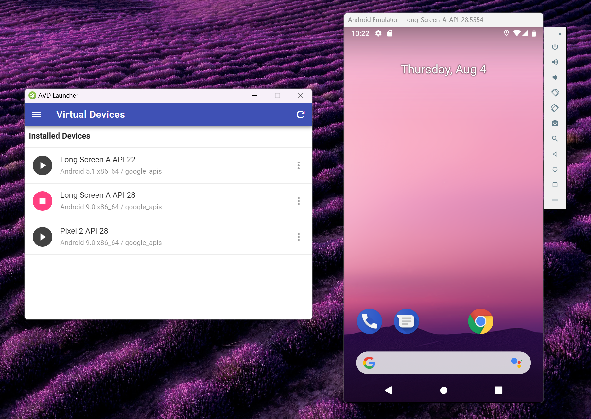
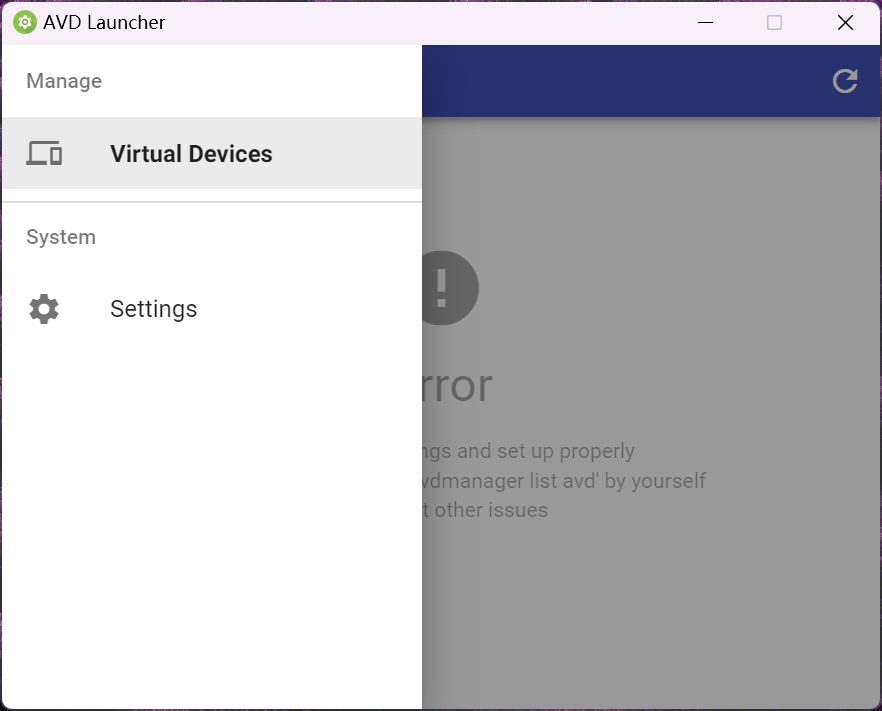

AVD Launcher
===========================

![][latest_version] ![][build_date] [![][license]][license_link]  
![][made_with] ![][supports]

[latest_version]: https://img.shields.io/badge/Version-0.1.0-green.svg?style=flat-square
[build_date]: https://img.shields.io/badge/Build%20Date-20220805-blue.svg?style=flat-square
[license]: https://img.shields.io/badge/License-MIT%20License-green.svg?style=flat-square
[license_link]: https://mit-license.org/

[made_with]: https://img.shields.io/badge/Made%20with-Electron-darkblue.svg?style=flat-square
[supports]: https://img.shields.io/badge/Supports-Microsoft%20Windows-blue.svg?style=flat-square

A frontend UI for launching Android Virtual Devices (avd) in the legacy window without having to start Android Studio. Including "boot with writable system image" option, if you want to test Magisk modules or root apps.



## Build from source

Reminder: If you simply want to use it instead of building it, download it from releases.

First create an empty directory, and then create `resources/app/` under that. Place the source in `resources/app/`.

Open `app` directory and initialize.

```plain
npm update
```

To test the source, run

```plain
npm run start
```

To build the distributable, run

```plain
npm run make
```

You can find binaries in `out/`.

## Setup

Before you can use AVD Launcher, you should install **Android Command-line Tools** using the SDK manager in Android Studio.

Put the executables under an empty directory, and start `avd-launcher.exe` to use.

You may see an error. In that case, check settings and set them correctly.



Hint: The target program executed is something like `d:/android_sdk/cmdline-tools/latest/bin/avdmanager.bat`.
